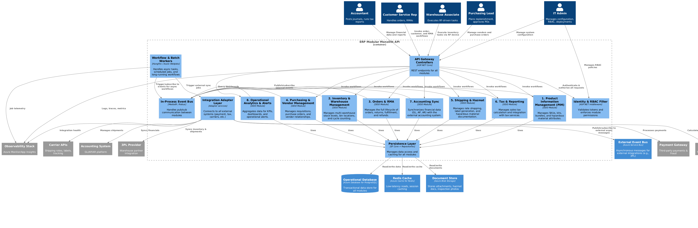
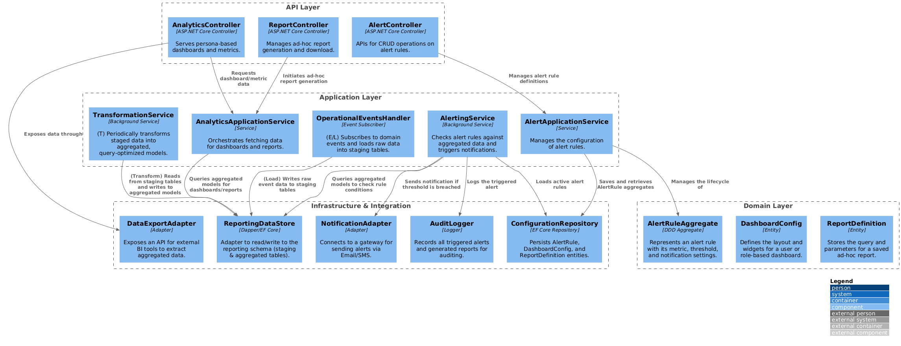
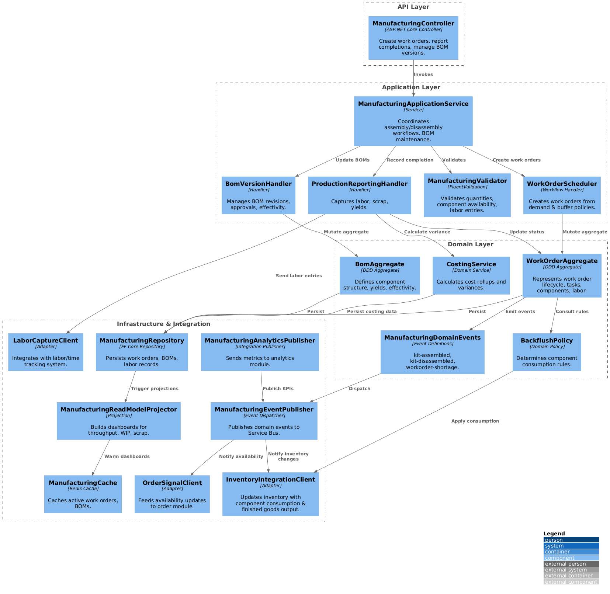

# C4 Model

This document contains the C4 models of the ERP/IMS system in PlantUML format.
This model describes the system at different levels of detail, from system context to code.

## C1 System Context

*Figure 1: C1 System Context Diagram*
[Reference code](../media/attachments/C4_model/C1_system_context/C1_system_context/C1_system_context.puml)

## C2 Container

*Figure 2: C2 Container Diagram*
[Reference code](../media/attachments/C4_model/C2_container/C2_container/C2_container.puml)

## C3 Component

### High Level Components

*Figure 3: C3 High Level Component Diagram*
[Reference code](../media/attachments/C4_model/C3_component/C3_component_high_level/C3_component_high_level.puml)

### Component Details

*Figure 4: Analytics Module Components*
[Reference code](../media/attachments/C4_model/C3_component/C3_component_analytics_module/C3_component_analytics_module.puml)

*Figure 5: Customer Service Module Components*
[Reference code](../media/attachments/C4_model/C3_component/C3_component_customer_service_module/C3_component_customer_service_module.puml)

*Figure 6: Forecasting Module Components*
[Reference code](../media/attachments/C4_model/C3_component/C3_component_forecasting_module/C3_component_forecasting_module.puml)

*Figure 7: Inventory Module Components*
[Reference code](../media/attachments/C4_model/C3_component/C3_component_inventory_module/C3_component_inventory_module.puml)

*Figure 8: Light Manufacturing Module Components*
[Reference code](../media/attachments/C4_model/C3_component/C3_component_light_mfg_module/C3_component_light_mfg_module.puml)

*Figure 9: Order Module Components*
[Reference code](../media/attachments/C4_model/C3_component/C3_component_order_module/C3_component_order_module.puml)

*Figure 10: Product Module Components*
[Reference code](../media/attachments/C4_model/C3_component/C3_component_product_module/C3_component_product_module.puml)

*Figure 11: Promotions Module Components*
[Reference code](../media/attachments/C4_model/C3_component/C3_component_promotions_module/C3_component_promotions_module.puml)

*Figure 12: Returns Module Components*
[Reference code](../media/attachments/C4_model/C3_component/C3_component_returns_module/C3_component_returns_module.puml)

*Figure 13: Shipping Module Components*
[Reference code](../media/attachments/C4_model/C3_component/C3_component_shipping_module/C3_component_shipping_module.puml)

*Figure 14: Tax Module Components*
[Reference code](../media/attachments/C4_model/C3_component/C3_component_tax_module/C3_component_tax_module.puml)

## C4 Code

*Figure 15: Analytics Module Code*
[Reference code](../media/attachments/C4_model/C4_code/C4_code_analytics_module/C4_code_analytics_module.puml)

*Figure 16: Customer Service Module Code*
[Reference code](../media/attachments/C4_model/C4_code/C4_code_customer_service_module/C4_code_customer_service_module.puml)

*Figure 17: Forecasting Module Code*
[Reference code](../media/attachments/C4_model/C4_code/C4_code_forecasting_module/C4_code_forecasting_module.puml)

*Figure 18: Integrations Module Code*
[Reference code](../media/attachments/C4_model/C4_code/C4_code_integrations_module/C4_code_integrations_module.puml)

*Figure 19: Inventory Module Code*
[Reference code](../media/attachments/C4_model/C4_code/C4_code_inventory_module/C4_code_inventory_module.puml)

*Figure 20: Light Manufacturing Module Code*
[Reference code](../media/attachments/C4_model/C4_code/C4_code_light_mfg_module/C4_code_light_mfg_module.puml)

*Figure 21: Order Module Code*
[Reference code](../media/attachments/C4_model/C4_code/C4_code_order_module/C4_code_order_module.puml)

*Figure 22: Product Module Code*
[Reference code](../media/attachments/C4_model/C4_code/C4_code_product_module/C4_code_product_module.puml)

*Figure 23: Promotions Module Code*[Reference code](../media/attachments/C4_model/C4_code/C4_code_promotions_module/C4_code_promotions_module.puml)

*Figure 24: Returns Module Code*
[Reference code](../media/attachments/C4_model/C4_code/C4_code_returns_module/C4_code_returns_module.puml)

*Figure 25: Shipping Module Code*
[Reference code](../media/attachments/C4_model/C4_code/C4_code_shipping_module/C4_code_shipping_module.puml)

*Figure 26: Tax Module Code*
[Reference code](../media/attachments/C4_model/C4_code/C4_code_tax_module/C4_code_tax_module.puml)