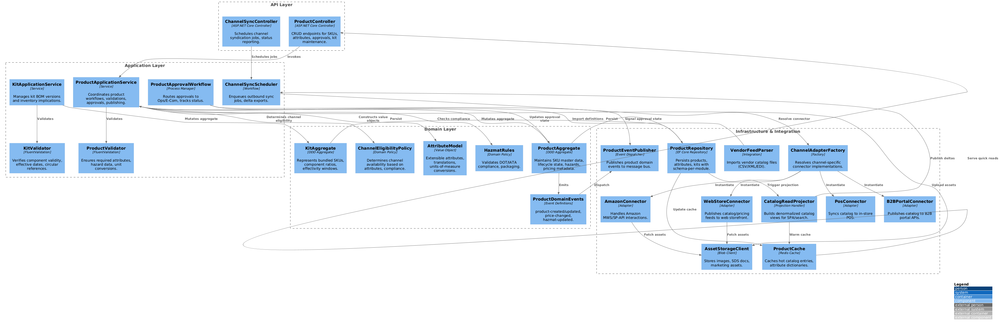
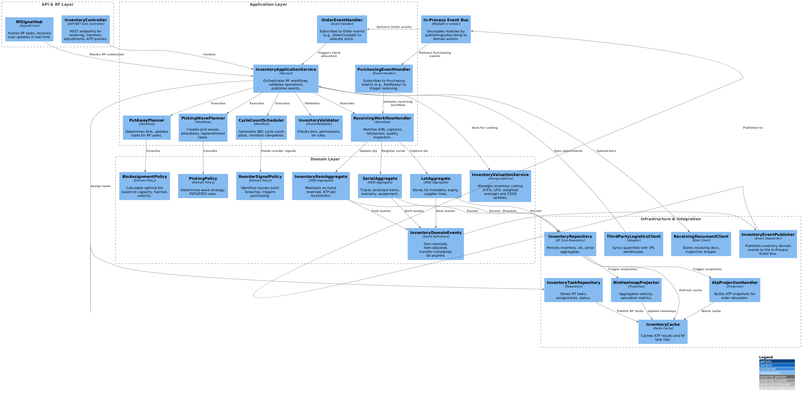
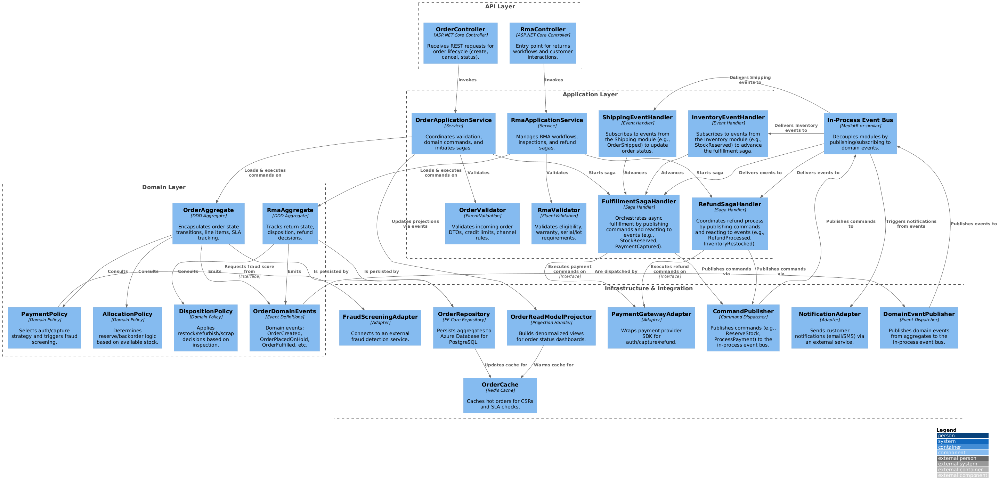
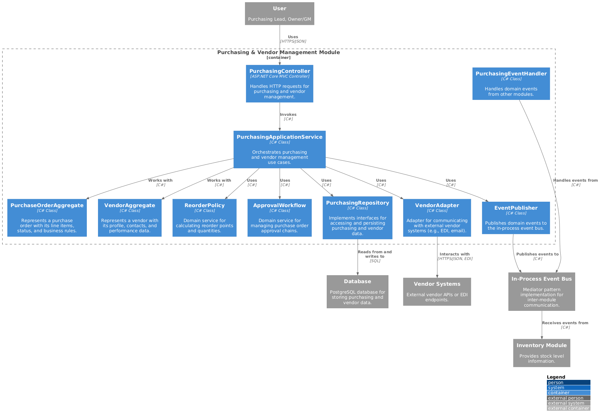
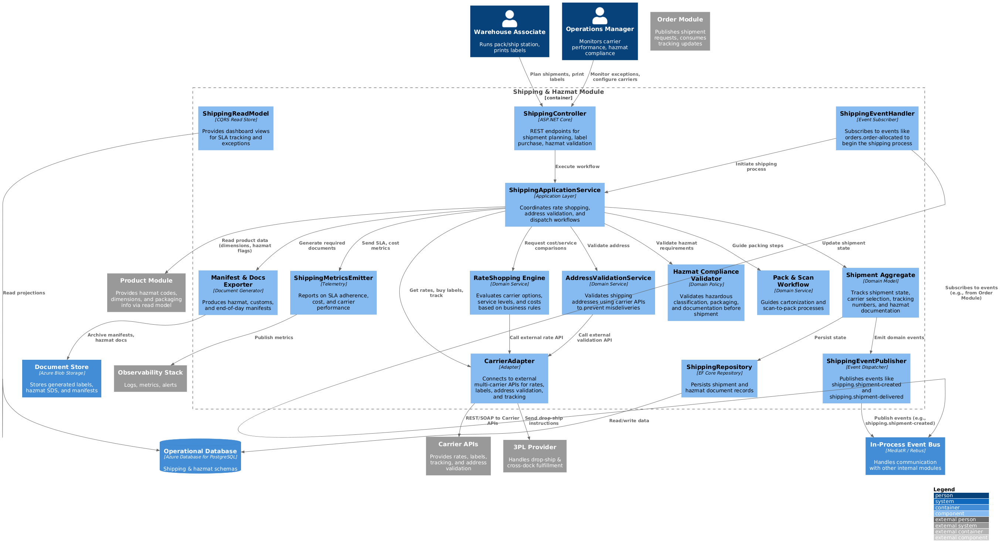

# C4 Model

This document contains the C4 models of the ERP/IMS system in PlantUML format.
This model describes the system at different levels of detail, from system context to code.

## C1 System Context

*Figure 1: C1 System Context Diagram*
[Reference code](../media/attachments/C4_model/C1_system_context/C1_system_context.puml)

## C2 Container

*Figure 2: C2 Container Diagram*
[Reference code](../media/attachments/C4_model/C2_container/C2_container.puml)

## C3 Component

### High Level Components

*Figure 3: C3 High Level Component Diagram*
[Reference code](../media/attachments/C4_model/C3_component/C3_component_high_level/C3_component_high_level.puml)

### Component Details

### 1. Product Information Management (PIM)

*Figure 4: C3 Component Diagram for PIM Module*
[Reference code](../media/attachments/C4_model/C3_component/C3_component_product_module/C3_component_product_module.puml)

*Figure 5: C4 Code Diagram for PIM Module*
[Reference code](../media/attachments/C4_model/C4_code/C4_code_product_module/C4_code_product_module.puml)

### 2. Inventory & Warehouse Management

*Figure 6: C3 Component Diagram for Inventory & Warehouse Management Module*
[Reference code](../media/attachments/C4_model/C3_component/C3_component_inventory_module/C3_component_inventory_module.puml)

*Figure 7: C4 Code Diagram for Inventory & Warehouse Management Module*
[Reference code](../media/attachments/C4_model/C4_code/C4_code_inventory_module/C4_code_inventory_module.puml)

### 3. Orders & Return Merchandise Authorization (RMA)

*Figure 8: C3 Component Diagram for Orders & RMA Module*
[Reference code](../media/attachments/C4_model/C3_component/C3_component_order_RMA_module/C3_component_order_RMA_module.puml)

*Figure 9: C4 Code Diagram for Orders & RMA Module*
[Reference code](../media/attachments/C4_model/C4_code/C4_code_order_module/C4_code_order_module.puml)

### 4. Purchasing & Vendor Management

*Figure 10: C3 Component Diagram for Purchasing & Vendor Management Module*
[Reference code](../media/attachments/C4_model/C3_component/C3_component_purchasing_and_vendor_management_module/C3_component_purchasing_and_vendor_management_module.puml)

*Figure 11: C4 Code Diagram for Purchasing & Vendor Management Module*
[Reference code](../media/attachments/C4_model/C4_code/C4_code_purchasing_and_vendor_management_module/C4_code_purchasing_and_vendor_management_module.puml)

### 5. Shipping & Hazmat

*Figure 12: C3 Component Diagram for Shipping & Hazmat Module*
[Reference code](../media/attachments/C4_model/C3_component/C3_component_shipping_module/C3_component_shipping_module.puml)

*Figure 13: C4 Code Diagram for Shipping & Hazmat Module*
[Reference code](../media/attachments/C4_model/C4_code/C4_code_shipping_module/C4_code_shipping_module.puml)

### 6. Tax & Reporting

*Figure 14: C3 Component Diagram for Tax & Reporting Module*
[Reference code](../media/attachments/C4_model/C3_component/C3_component_tax_module/C3_component_tax_module.puml)

*Figure 15: C4 Code Diagram for Tax & Reporting Module*
[Reference code](../media/attachments/C4_model/C4_code/C4_code_tax_module/C4_code_tax_module.puml)

### 7. Accounting Sync

*Figure 16: C3 Component Diagram for Accounting Sync Module*
[Reference code](../media/attachments/C4_model/C3_component/C3_component_accounting_sync_module/C3_component_accounting_sync_module.puml)

*Figure 17: C4 Code Diagram for Accounting Sync Module*
[Reference code](../media/attachments/C4_model/C4_code/C4_code_accounting_sync_module/C4_code_accounting_sync_module.puml)

### 8. Operational Analytics & Alerts

*Figure 18: C3 Component Diagram for Operational Analytics & Alerts Module*
[Reference code](../media/attachments/C4_model/C3_component/C3_component_analytics_module/C3_component_analytics_module.puml)

*Figure 19: C4 Code Diagram for Operational Analytics & Alerts Module*
[Reference code](../media/attachments/C4_model/C4_code/C4_code_analytics_module/C4_code_analytics_module.puml)

